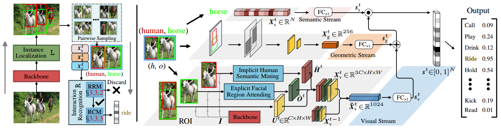

# Cascaded Human-Object Interaction Recognition

### Code will be released soon.

This repository contains the PyTorch implementation for [CVPR 2020](http://cvpr2020.thecvf.com/) Paper "[Cascaded Human-Object Interaction Recognition]" by Tianfei Zhou, Wenguan Wang, Siyuan Qi, Jianbing Shen, Haibin Ling.

    

